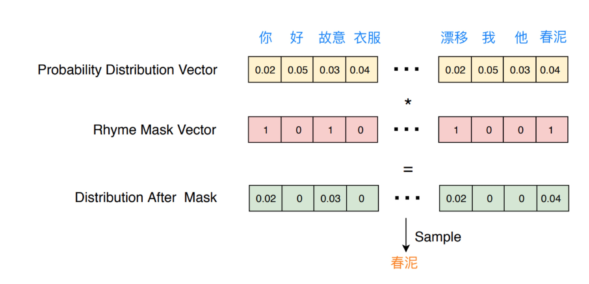

# Hip-Hop-Seq2seq

Projects of DeeCamp2018, hip-hop lyrics generation using Seq2Seq.


## Setup

* python 3.6
* tensorflow==1.4
* jieba

## Model

基于[nmt模型](https://github.com/tensorflow/nmt)，在inference部分进行了一些修改。


### decoder

设计了两种hook的生成方式：

1. hook中每一句的第一个词一样

> ```
> 和你我不说累一切都无所谓
> 和你我不后悔和你我不流泪
> 和你我不说累一切都无所谓
> 和你我不后悔和你我不流泪
> ```

2. 生成的句子与原始句子押韵（inference时将不押韵的词的概率置0）

> ```
> 你感受冰冷的风
> 也曾经感受过梦
> 像一场不敢醒来不痛的梦
> 你试过苦涩的痛
> 没想过郁郁而终
> ```



## Training and Evaluate

在项目主目录下，运行下面的命令训练第一种hook生成模型：

```bash
python3 -m seq2seq.train\
        --source_train_data="seq2seq/data/v2/train.src"\
        --target_train_data="seq2seq/data/v2/train.tgt"\
        --source_dev_data="seq2seq/data/v2/dev.src"\
        --target_dev_data="seq2seq/data/v2/dev.tgt"\
        --src_vocab_file="seq2seq/data/v2/vocab.tgt"\
        --tgt_vocab_file="seq2seq/data/v2/vocab.tgt"\
        --src_vocab_size=43836\
        --tgt_vocab_size=43836\
        --share_vocab=True\
        --out_dir="seq2seq/model1"\
        --decoder_rule="samefirst"\
        --num_epochs=60
```

运行下面的命令训练第二种hook生成模型：

```bash
python3 -m seq2seq.train\
        --source_train_data="seq2seq/data/v3/train.src"\
        --target_train_data="seq2seq/data/v3/train.tgt"\
        --source_dev_data="seq2seq/data/v3/dev.src"\
        --target_dev_data="seq2seq/data/v3/dev.tgt"\
        --src_vocab_file="seq2seq/data/v3/vocab.tgt"\
        --tgt_vocab_file="seq2seq/data/v3/vocab.tgt"\
        --src_vocab_size=23442\
        --tgt_vocab_size=23442\
        --share_vocab=True\
        --out_dir="seq2seq/model3"\
        --decoder_rule="rhyme"\
        --num_epochs=60
```

## Inference

训练好模型后，运行下面的命令进行第一种hook的inference：

```bash
python3 -m seq2seq.test_inference\
        --src_vocab_file="seq2seq/data/v2/vocab.tgt"\
        --tgt_vocab_file="seq2seq/data/v2/vocab.tgt"\
        --src_vocab_size=43836\
        --tgt_vocab_size=43836\
        --share_vocab=True\
        --out_dir="seq2seq/model1"\
        --inference_input_file="seq2seq/data/plana/1.0.txt"\
        --inference_output_file="seq2seq/model1/output"\
        --decoder_rule="samefirst"
```

第二种hook的inference：

```bash
python3 -m seq2seq.test_inference\
        --src_vocab_file="seq2seq/data/v3/vocab.tgt"\
        --tgt_vocab_file="seq2seq/data/v3/vocab.tgt"\
        --src_vocab_size=23442\
        --tgt_vocab_size=23442\
        --share_vocab=True\
        --out_dir="seq2seq/model3"\
        --inference_input_file="seq2seq/data/plana/1.0.txt"\
        --inference_output_file="seq2seq/model3/output"\
        --rhyme_table_file="seq2seq/data/v3/table_23442.npy"\
        --decoder_rule="rhyme"
```

## Run Server

在项目主目录下运行下面的命令开启服务。
```bash
bash server.sh
```

## References

-  Dzmitry Bahdanau, Kyunghyun Cho, and Yoshua
   Bengio. 2015.[ Neural machine translation by jointly learning to align and translate](https://arxiv.org/pdf/1409.0473.pdf). ICLR.
-  Minh-Thang Luong, Hieu Pham, and Christopher D
   Manning. 2015.[ Effective approaches to attention-based neural machine translation](https://arxiv.org/pdf/1508.04025.pdf). EMNLP.
-  Ilya Sutskever, Oriol Vinyals, and Quoc
   V. Le. 2014.[ Sequence to sequence learning with neural networks](https://papers.nips.cc/paper/5346-sequence-to-sequence-learning-with-neural-networks.pdf). NIPS.


##  News

[Homie快来听，AI的嘻哈也很酷 | DeeCamp Show](https://mp.weixin.qq.com/s/AmPVQRoNNKxyN98JXmJ8zA)

[填词作曲斗图搞艺术，AI统统都可以](https://mp.weixin.qq.com/s/tWJSQlB3f7sLtZhzhXVoMA)

[2分钟写出一首嘻哈歌曲：95后AI创新团队叫板“中国新说唱”](https://m.mp.oeeee.com/a/BAAFRD00002018082498426.html?&layer=2&share=chat&isndappinstalled=0&ndsign=fynIrURHAqytWQpdnHXOhvmMb4+dNXbHfAPMojUNgOIPI2VW2OW1w/MFRfIXNmGMk9jhqq3jWdvdX96DRTkZZ0VOeJ7QbGVX36X362MaVlKvFDViH1sfteRiN67VhX7F39H6/KlPd8jEmuhmdYaJ72NlMjQzYTAwY2M3ZWEyZjVjYWJkNTk0MzA4NTMyOWEzYU0m+hfgGYZho4YTUdzk3Q==827c9c8481416215ca20b9a12205f0af&wxuid=ogVRcdFchB7Q13PYm58c3stf9aIY&wxsalt=f0e39f&wxOauth=1)

## Demo

视频展示：[YouTube](https://www.youtube.com/watch?v=svuSKZBIePE)

